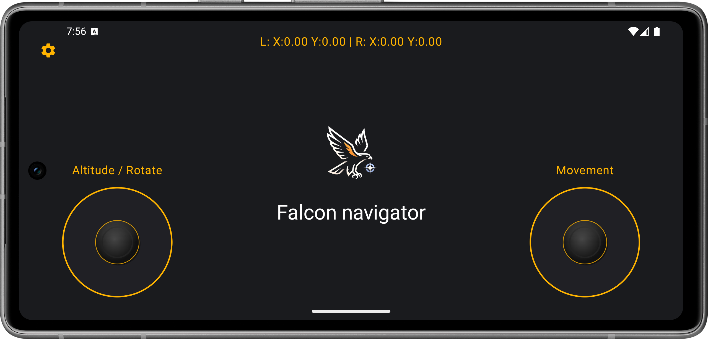
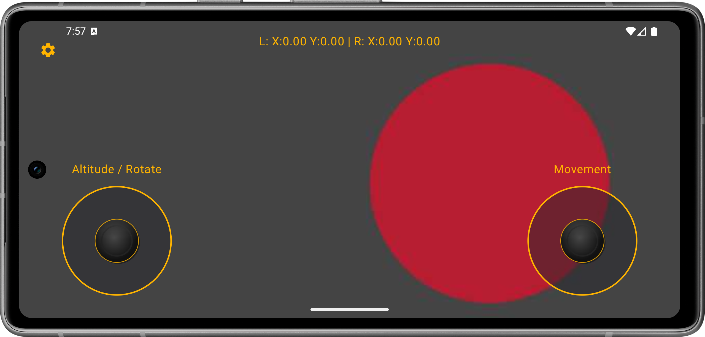
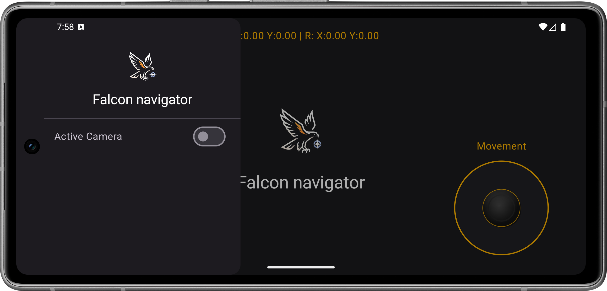

# 🦅 Falcon Navigator

**Falcon Navigator** is an advanced Android application designed for piloting and controlling Micro UAVs (Unmanned Aerial Vehicles). Built with the latest Android development technologies, it provides a smooth, precise, and real-time experience for pilots.

---

## 📸 Screenshots

Here are some glimpses of the application interface:

| Main Controller | Settings Menu | Camera View |
|:---:|:---:|:---:|
|  |  |  |

---

## 🚀 Key Features

### 1. Precision Dual Joystick Control
- **Left Joystick:** Controls **Altitude** and **Rotation** (Yaw).
- **Right Joystick:** Controls **Movement** (Pitch & Roll).
- Ergonomic design with clear labels for intuitive operation.

### 2. Real-time Video Streaming
- Receives live video feed from the UAV via **TCP/UDP Socket**.
- Full-screen immersive video display for complete situational awareness.
- Optimized for low-latency streaming.

### 3. High-Frequency Data Transmission
- Sends control commands every **10 milliseconds**.
- Ensures immediate and accurate UAV response to joystick inputs.
- Utilizes **Kotlin Coroutines** for efficient threading and lag-free performance.

---

## 🛠 Tech Stack & Architecture

This project follows the **MVVM (Model-View-ViewModel)** architecture and is developed entirely in **Kotlin**.

- **UI Framework:** [Jetpack Compose](https://developer.android.com/jetpack/compose) - For modern, reactive UI design.
- **Dependency Injection:** [Hilt](https://dagger.dev/hilt/) - For dependency injection and modular code structure.
- **Asynchronous Programming:** [Kotlin Coroutines & Flow](https://kotlinlang.org/docs/coroutines-overview.html) - For managing background tasks and data streams.
- **Network:** Raw Sockets - For fast, low-level communication with hardware.

### Project Structure
- **ui/**: UI Screens and components (e.g., `Joystick`, `JoystickScreen`).
- **viewmodel/**: UI state management and data layer interaction (`JoystickViewModel`).
- **data/repository/**: Repositories for business logic (`CameraRepository`, `ControllerRepository`).
- **data/remote/**: Low-level communication services (`SocketService`).

---

## 📦 How to Run

1. Open the project in **Android Studio**.
2. Connect an Android device or start an emulator (Landscape mode recommended).
3. Click **Run**.
4. To test the connection, ensure the UAV hardware (or a socket simulator) is active on the IP and Port configured in `CameraRepositoryImpl` (Default: `192.168.1.1:8080`).

---

**Developed with ❤️ for Flight.**
